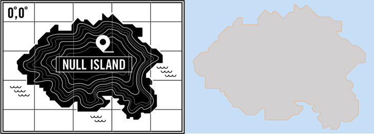

# Null Island
I couldn't find a Null Island GeoJSON file, so [I made one](GeoJSON/null-island.geo.json).

Here's my recipe:

* Start with the [SVG from GNIP](https://github.com/gnip/null-island)
* Use Illustrator & Photoshop to remove the decorations and create a cleaned outline
* Export to SVG
* Churn into a GeoJSON file with your text editor of choice
* Use [geojson.io](http://geojson.io) to generate a Shapefile
* Use [ArcGIS Desktop](http://www.esri.com/software/arcgis/arcgis-for-desktop) to reposition at 0,0 and scale to about [6,400 hectares](http://www.nullisland.com/geography.html)
* Use Ben Balter's [simple instructions](http://ben.balter.com/2013/06/26/how-to-convert-shapefiles-to-geojson-for-use-on-github/) to convert back to GeoJSON with [GDAL](http://www.gdal.org)
* Use Excel and the text editor to tidy coordinates to 5 decimal places, or about 1m accuracy - huge overkill considering everything else :)

##### Why this way?
Yeah, I know, I could have just exported from Illustrator into ArcGIS Desktop via EPS, but I didn't this time. [Here's a project](https://github.com/nixta/ahc) where I *did* go that way. In fact, this non-EPS way was definitely not as easy, but I was playing with a few approaches and this is what shook out.

I would also have liked to have done the shrink to 5 decimal places using regular expressions, but I had a soccer match to watch.

##### Big Thanks
Big thanks to [@gnip](https://github.com/gnip) and [@benbalter](https://github.com/benbalter) for the original graphics and super-simple GDAL instructions.

## License
When I created this repo there was no license on the source data. Now there is.

Please remember that GNIP owns the source data and your use of this derived data should be based on their license at https://github.com/gnip/null-island

Currently that is Creative Commons Non-Commercial. As far as I understand it this means that:

- You can use the data for non-commercial purposes.
- "Currently" doesn't mean anything - this license is irrevokable for all time. Enjoy the data no matter how GNIP/Twitter/X decide to change things.

Note that I am not a lawyer, have never been a lawyer, never want to be a lawyer, and don't anticipate becoming a lawyer. This applies equally to real life as well as "on TV". Focus more on the license info over at [the source data repo](https://github.com/gnip/null-island) than my interpretation above.
